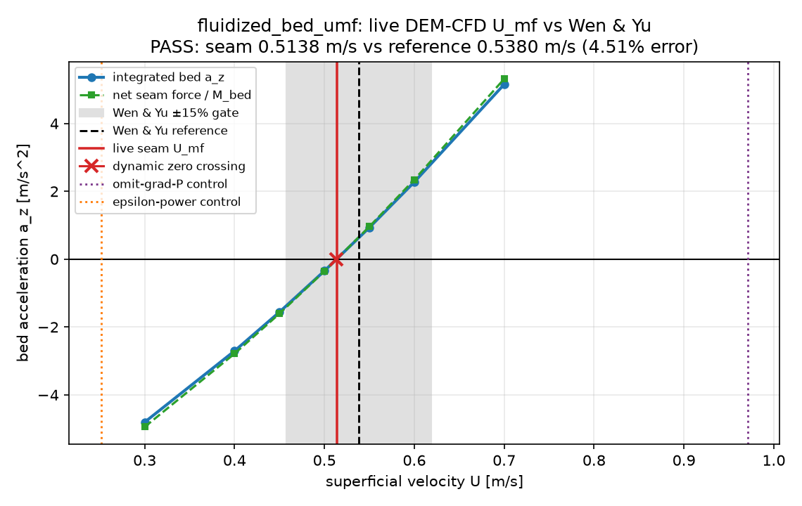
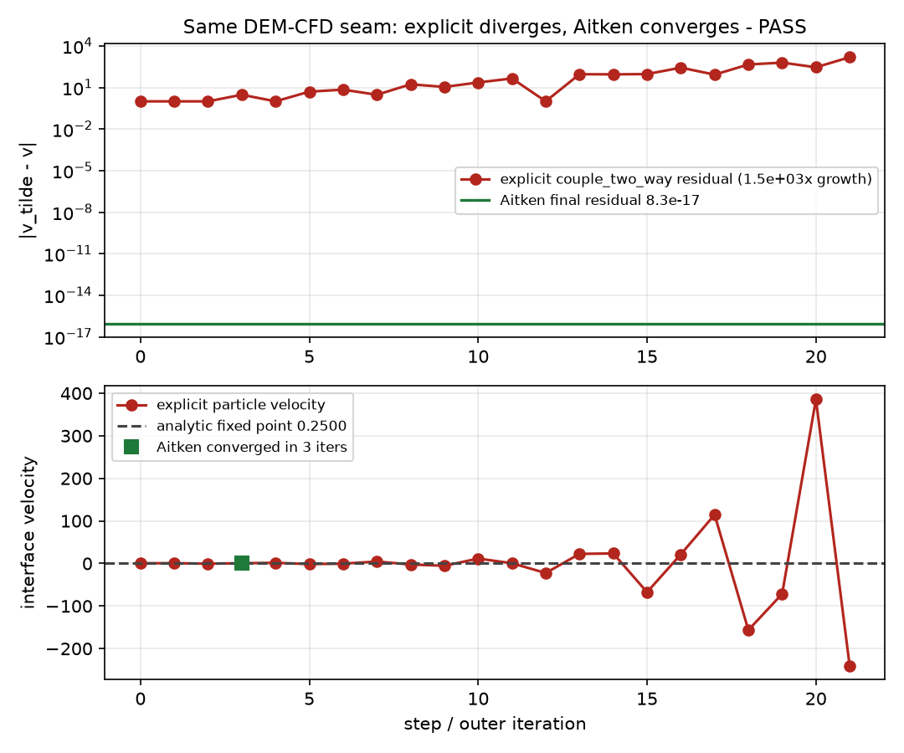

# dev_couple_dem_cfd

<!-- disclaimer-banner -->
> This code was fully written via **Claude 4.6,4.8 and Fable 5**, and stands as a proof of concept for a **bevy-like** ecosystem for physics simulation research, with the goal of testing if one scheduler/framework (**GRASS**) works for most scientific codes. **SOIL** and **FIELD** are particle- and mesh-based substrates for physics such as **DIRT** (DEM) or **dev_field_efvm**. Note that all other physics based repos I have start with **dev_**, as I do **NOT** know these methods. Please read, evaluate, use with a grain of salt, I have not personally read or reviewed everything here.
<!-- /disclaimer-banner -->



Figure: `fluidized_bed_umf` PASS. The DEM-CFD seam gives `U_mf = 0.5138 m/s`
versus Wen & Yu `0.5380 m/s`, a `4.51%` relative error inside the `15%` gate.

A **cross-substrate coupling**: it joins the granular **DEM** side — SOIL particles
([soil](https://github.com/SueHeir/soil)) and, for bonded bodies, DIRT's bond model
([dirt](https://github.com/SueHeir/dirt)) — to the compressible-CFD tier
[dev_field_efvm](https://github.com/SueHeir/dev_field_efvm) (a mesh/FIELD solver)
through **GRASS's open-box coupling layer** (`grass_multi`). It is not a physics tier
of its own — it owns no new solver, only the seam between two, where the fluid exerts
drag on the grains and the grains displace and block the fluid.

```
GRASS   framework: App, Plugin, Scheduler, coupling (grass_multi)
  ├─ SOIL  (particle substrate) ── soil grains + dirt bonds   granular DEM  ┐
  └─ FIELD (mesh substrate)     ── dev_field_efvm  compressible CFD (Riemann/IBM) ┘
                                          └── dev_couple_dem_cfd  ← the coupling (you are here)
```

## Why a separate repo

A coupling that depends on **two** substrate tiers does not belong inside either one —
these examples used to live in `dev_field_efvm`, and burying them there made that CFD
tier drag in a SOIL (and DIRT) dependency it otherwise has no business with. Cross-
substrate couplings (SOIL ↔ FIELD) are their own thing: they need `grass_multi` + an
interphase drag seam, and they compose two independently-developed tiers. So each such
coupling gets its own `dev_couple_*` repo, depending on its two partner tiers and
nothing more. (Its SPH sibling is [dev_couple_sph_cfd](https://github.com/SueHeir/dev_couple_sph_cfd).)

## Start here: coupling is composition

The validation programs are deliberately exhaustive; they are not the first
thing a new reader should have to decipher. The runnable
[`hello_dem_cfd`](examples/hello_dem_cfd/main.rs) lesson reduces the public idea
to this:

```rust
let mut app = App::new();

app.add_subapp("dem", setup::dem())
    .add_subapp("cfd", setup::cfd())
    .add_plugins(DemCfdCouplingPlugin::for_air(RADIUS, 200, DT, GRAVITY))
    .start();
```

Only a few lines? Not really: `DemCfdCouplingPlugin` does the heavy lifting.
The important point is that `setup::dem()` is a standalone gravity-driven DEM
App and `setup::cfd()` is a standalone CFD App. Neither was edited for coupling,
and neither knows the other exists.

When the plugin is added, it configures both sub-Apps before either starts. It
adds the particle export and fluid-force input to DEM; adds particle input,
Wen–Yu/Gidaspow exchange, and the equal-and-opposite momentum sink to CFD; and
owns the coupled execution schedule. All knowledge of the seam lives in the
coupling plugin.

```bash
cargo run --release --example hello_dem_cfd
```

Read `main.rs` first. Its adjacent `setup.rs` contains only the two ordinary
solver setups, making the absence of coupling knowledge directly inspectable.

## Structure — a reusable crate + thin examples

The pieces every *unresolved* (Euler–Lagrange, void-fraction) DEM↔CFD simulation
repeats live in one library crate, so an example `main` reads as its physics, not
its plumbing:

```
crates/dem_cfd/          the reusable coupling layer
  config   [gas]/[particle]/[mesh]/[packing] blocks
  drag     void-fraction β closures (MacDonald/Ergun) + SeamMode
  reference Wen&Yu / Ergun / Archimedes (kept out of the measured path)
  bed      deposit packing → coarse mesh, impose flow, momentum sink, FCC packing
  seam     grass_multi scaffold: seam resources, CFD base, couple_two_way(), accessors
examples/<name>/         each keeps only its FORCE MODEL + validation + driver
```

What a case supplies: its **force model** (the seam system — point-particle drag,
drag-only, or drag+∇P+buoyancy), its **topology** if non-standard (the static
packed bed is a two-phase export-once schedule, not the dynamic four-phase one),
and its **validation** gates. Fully *resolved* IBM couplings (a body meshed into
the gas, like `cfd_ibm_fiber`) are a different pattern and do not use `dem_cfd`.

## The same coupling contract, local or MPI

The teaching and physical-validation examples mount DEM and CFD as local child
Apps under one parent. The distributed tests use GRASS's current topology
contract: one TOML document declares the `dem` and `cfd` roles, and the same
test binary selects local or split-MPI execution from the launched world size.
There is no second MPI-specific solver executable.

The runnable [`routed_dem_cfd`](examples/routed_dem_cfd/main.rs) example is the
literal same-binary demonstration. Its adjacent
[`config.toml`](examples/routed_dem_cfd/config.toml) uses `mode = "auto"`: world
size 1 composes both roles locally, while five ranks become 3 DEM + 2 CFD.

```bash
cargo run --example routed_dem_cfd --features mpi-routing
cargo build --example routed_dem_cfd --features mpi-routing
mpirun --oversubscribe -np 5 target/debug/examples/routed_dem_cfd
```

- [`routed_3x2.rs`](crates/dem_cfd/tests/routed_3x2.rs) is the smallest complete
  3-DEM/2-CFD position-to-owner and stable-ID force-return example.
- [`routed_trajectory_3x2.rs`](crates/dem_cfd/tests/routed_trajectory_3x2.rs)
  adds moving particles, ownership crossings, SOIL's 3-D ownership directory,
  transactional `ParticleStore` migration (including a registered extension
  marker that must follow its stable ID), and temporal impulse checks. Contact
  ghosts/bonds are still a later solver-level validation, not implied here.
- [`routing.rs`](crates/dem_cfd/src/routing.rs) contains the coupling-owned wire
  records and FIELD `PartitionDirectory` lookup. GRASS transports addressed
  bytes; it does not know particles, meshes, positions, or ownership policy.

Run the real distributed path with:

```bash
source ~/projects/.build-env
cargo test -p dem_cfd --features mpi-routing --test routed_3x2 -- --nocapture
cargo test -p dem_cfd --features mpi-routing --test routed_trajectory_3x2 -- --nocapture
```

The parent owns cross-solver reads and writes. Child solvers receive ordinary
`Res`/`ResMut` for their own resources; they do not reach sideways into a peer
App. Where a coupling must stop inside a loop, branch, or rollback-capable
step, the child exports a scheduler seam and the parent drives `resume()` to
that named boundary before exchanging data.

## What it does — resolved and unresolved particle–fluid coupling

The physical cases span these coupling regimes:

| example | coupling | validates against |
|---|---|---|
| `hello_dem_cfd` | minimal composition lesson using point-particle drag | teaching example; validated closure reused below |
| `settling_sphere` | point-particle drag (Wen–Yu/Gidaspow) | Stokes (1851) terminal velocity |
| `fixed_bed_ergun` | packed-bed drag closure | Ergun (1952) pressure drop |
| `fluidized_bed_umf` | DEM bed ↔ gas, bisection on net seam force | Wen & Yu (1966) minimum fluidization |
| `adaptive_umf_strategy` | DEM bed ↔ gas, strategy cadence sweep | Wen & Yu U_mf + coupling residual reduction |
| `implicit_added_mass` | dense added-mass interface stress case | explicit divergence + Aitken convergence on the same seam |
| `cfd_ibm_fiber` | DIRT bonded-sphere clump ↔ gas (resolved IBM) | Archimedes buoyancy + Tirado slender-body drag |

```bash
# all partner repos are sibling checkouts (grass, soil, field, dirt, dev_field_efvm)
cargo run --release --example settling_sphere   -- examples/settling_sphere/config.toml
cargo run --release --example fixed_bed_ergun    -- examples/fixed_bed_ergun/config.toml
cargo run --release --example fluidized_bed_umf  -- examples/fluidized_bed_umf/config.toml
cargo run --release --example adaptive_umf_strategy -- examples/adaptive_umf_strategy/config.toml
cargo run --release --example implicit_added_mass -- examples/implicit_added_mass/config.toml
cargo run --release --example cfd_ibm_fiber      -- examples/cfd_ibm_fiber/config.toml
```

## Validation

See [VALIDATION.md](VALIDATION.md) for the measured-vs-reference results and figures.
The fluidized-bed gate compares the live DEM-CFD minimum-fluidization velocity
against Wen & Yu:


The settling-sphere gate relaxes onto the Stokes / Schiller–Naumann terminal velocity
through the live drag seam:


The added-mass gate uses the same seam to show the shared-state access story:
explicit `couple_two_way` diverges on a strong interface map, while the parent can
snapshot the DEM state, advance CFD only to its exported `cfd.interface_ready`
seam, run a tentative DEM response, roll it back, and inject the relaxed state
with `converge_outer_iter` + Aitken relaxation:



The companion [`closed_momentum`](crates/dem_cfd/tests/closed_momentum.rs) gate
isolates the gas from boundary fluxes and directly verifies the realized update
`Δp_gas + Δp_particles = 0`, catching sink sign, magnitude, and cell-volume
errors independently of the routed temporal-impulse test.

## License

MIT OR Apache-2.0
