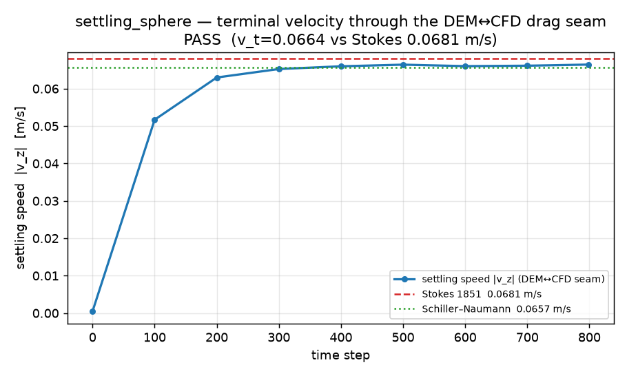

# Validation — dev_couple_dem_cfd

Every example here is a **coupling** validation: it exercises the DEM↔CFD interphase
drag seam (`cfd_ibm::coupling`) against a literature reference, with an independent
closure and a negative control so a passing gate cannot be a tautology. All numbers
below were reproduced in this repo (release build, sibling path deps). Reproduce with
`./validation/run.sh` (smoke) or `./validation/run.sh full`.

## settling_sphere — Stokes terminal velocity (point-particle seam)

A 30 µm glass sphere settling in air at Re ≈ 0.13 (Stokes regime). The unresolved
Wen–Yu/Gidaspow drag closure balances buoyant weight; the measured terminal velocity
is checked against the Stokes (1851) closed form with the Schiller–Naumann correction.

| observable | measured | reference | rel. err | tol |
|---|---|---|---|---|
| terminal velocity `v_t` | 0.06620 m/s | Stokes 0.06809 m/s | **2.78 %** | 6 % |
| force balance `\|F_f−mg\|/mg` | 0.34 % | — | — | 3 % |
| terminal Re | 0.133 | regime gate | — | < 1 |
| two-way momentum error | 0.0 | conservation | — | 1e-6 |

## fixed_bed_ergun — Ergun (1952) packed-bed pressure drop

Superficial gas driven through a packed SOIL bed; the seam pressure drop is compared
to the Ergun correlation across a Reynolds sweep, with an **independent MacDonald (1979)**
closure (so the check is not self-referential) and a corrupted-seam negative control.

| observable | measured | reference | tol |
|---|---|---|---|
| Ergun rel. err over `Re_p ∈ [1.1, 444]` | **5.63 % – 19.78 %** | Ergun (1952) | ≤ 25 % |
| negative control (corrupted ε-power seam) | 199.5 % | must fail | > 25 % |
| momentum conservation | 5.7e-13 | sanity | 1e-6 |

## fluidized_bed_umf — Wen & Yu (1966) minimum fluidization

Minimum fluidization velocity measured by **bisection on the live net seam force** on a
DEM bed, cross-checked against Wen & Yu, with Ergun/MacDonald exact-balance brackets and
two negative controls (omit-∇P, ε-power bug).

| observable | measured | reference | rel. err | tol |
|---|---|---|---|---|
| `U_mf` (seam, live bisection) | 0.5138 m/s | Wen & Yu 0.5380 m/s | **4.51 %** | 15 % |
| `U_mf` (dynamic onset, a_z zero-crossing) | 0.5135 m/s | matches seam | < 5 % | — |
| negative controls (omit-∇P / ε-bug) | +80.4 % / −53.2 % | must fail | > 15 % |

## cfd_ibm_fiber — resolved bonded-clump immersed body (DIRT ↔ CFD)

A slender fiber built as a **DIRT BPM bonded-sphere chain** immersed in the gas via the
ghost-cell IBM. Two stages: (1) exact hydrostatic coupling (Archimedes buoyancy), (2)
drag anisotropy of a slender body vs Tirado–García de la Torre, with a single-bead and
`r=1` (isotropic) control that must be rejected.

| observable | measured | reference | rel. err | tol |
|---|---|---|---|---|
| Stage 1 buoyancy | 1.21 % | Archimedes exact | — | PASS |
| uniform-field null | 4.3e-11 | 0 | — | — |
| Stage 2 drag ratio `r_low` | 1.3098 | Tirado 1.2772 | **2.55 %** | 8 % |
| steady plateau peak-to-peak | 1.74 % | — | — | 2 % |

---

_Figures are committed under `examples/<name>/plots/`. `settling_sphere` regenerates its
figure via `$BENCH_PYTHON examples/settling_sphere/plot.py`; graph backfill for the other
three cases is tracked as follow-up (they currently report PASS/FAIL numerically)._
