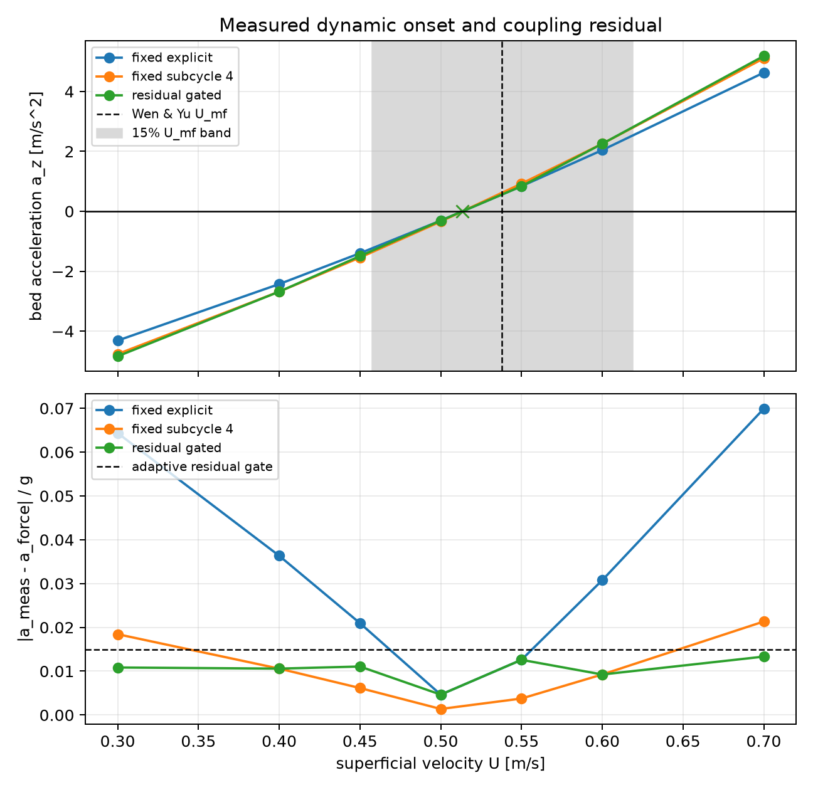

# Adaptive UMF Coupling Strategy

This example is about a simple question:

> When DEM grains and a CFD gas solver have to talk to each other, how often
> should they talk?

Near minimum fluidization, that question matters. The gas is just strong enough
to start lifting the bed. If the solvers exchange information too coarsely, the
bed can look too jumpy or too wrong even when the drag law itself is fine. This
example keeps the same science target as `fluidized_bed_umf`, then changes only
the coupling strategy.

## The Tiny Version

Picture three pieces:

- the DEM bed knows where the grains are and how they move,
- the CFD seam knows how much upward gas force the bed should feel,
- GRASS decides the order in which those two pieces exchange information.

The reusable GRASS schedule is:

```text
send grain motion to the seam
compute the gas force
send the gas force back to the grains
advance the grain bed
```

That is the coupling. No new GRASS infrastructure is added here. The example
just asks whether one big exchange is good enough, or whether the same exchange
should be repeated in smaller pieces when the bed is sensitive.

## What Is Being Validated

The science reference is still minimum fluidization. The example asks:

> At what inlet velocity does the upward gas support the weight of the bed?

The measured value is checked against the Wen & Yu minimum-fluidization
correlation, using the same live DEM-CFD seam as the `fluidized_bed_umf`
example.

The run also tracks a coupling residual:

```text
residual = |measured bed acceleration - acceleration predicted by the seam force| / g
```

In plain language: after a coupling interval, did the bed move the way the gas
force said it should move?

## Strategies Compared

| strategy | plain meaning |
|---|---|
| `fixed_explicit` | the solvers exchange information once per large interval |
| `fixed_subcycle_4` | the same exchange is split into four smaller substeps |
| `residual_gated` | try 1, 2, 4, then 8 substeps; stop once the residual is small enough |

All three use the same force model and the same GRASS coupling sequence. The
only difference is the cadence of the exchange.

## How To Read The Plot



The plot is meant to show two things at once:

- the fluidization onset is still anchored to Wen & Yu,
- the residual-gated strategy gets the coupling residual under control with fewer
  assumptions baked into the timestep choice.

The plotted run passes:

- live-seam `U_mf = 0.5138 m/s`,
- Wen & Yu reference `U_mf = 0.5380 m/s`,
- relative error `4.51%` with tolerance `15%`,
- all dynamic zero crossings match the live seam within `5%`,
- residual-gated worst residual is `0.0133 g`, below the `0.015 g` gate,
- residual-gated improves the worst residual by `5.25x` versus fixed explicit.

Negative controls still fail the Wen & Yu gate:

- omitting pressure-gradient buoyancy shifts `U_mf` by `+80.4%`,
- corrupting the epsilon-power reduction shifts `U_mf` by `-53.2%`.

## Why This Example Exists

This is the GRASS story in a small science case. The point is not just that DEM
and CFD can exchange fields. The point is that the coupling algorithm itself is
visible as a schedule: exchange once, subcycle, or adapt based on a residual.

That makes the coupling strategy inspectable, testable, and swappable without
rewriting the DEM solver or the CFD solver.

Regenerate with:

```bash
$BENCH_PYTHON examples/adaptive_umf_strategy/plot.py
```
