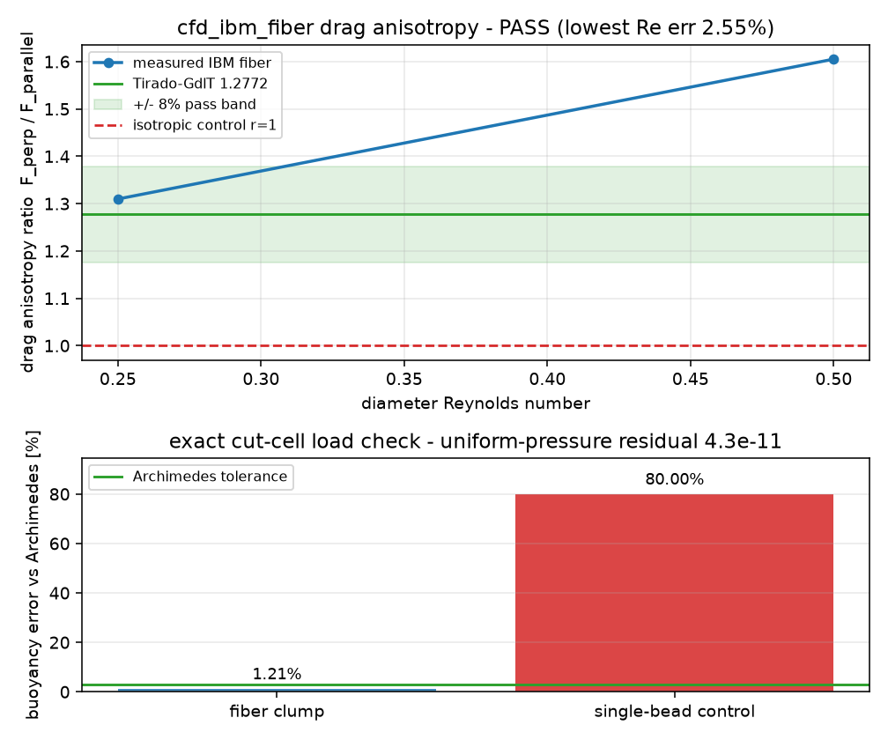

# cfd_ibm_fiber

Resolved IBM validation for a DIRT BPM bonded-sphere fiber in the DEM-CFD coupling
repo. The example first checks the multi-sphere surface-load handoff against
Archimedes' buoyancy in an analytic hydrostatic field, then measures the fiber drag
anisotropy ratio against the Tirado-Garcia de la Torre slender-body reference. The
single-bead and `r = 1` isotropic controls are rejected by the same gates.

```bash
cargo run --release --example cfd_ibm_fiber -- examples/cfd_ibm_fiber/config.toml
$BENCH_PYTHON examples/cfd_ibm_fiber/plot.py
```



Figure: measured buoyancy error and drag anisotropy from the example run versus the
Archimedes and Tirado references, with tolerance/pass lines and isotropic controls
visible; current committed result is PASS.
