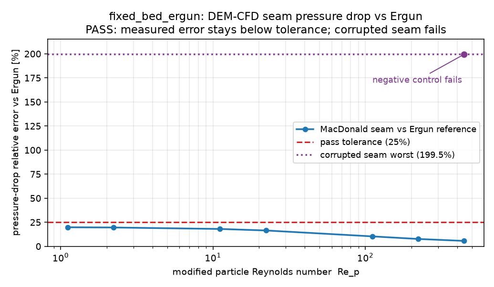

# fixed_bed_ergun

Static FCC beds of spheres are driven by a superficial gas velocity sweep and the
DEM-CFD seam assembles the packed-bed pressure drop. The measured path uses the
independent MacDonald et al. (1979) packed-bed closure through the seam, while the
reference is the Ergun (1952) correlation.

```bash
cargo run --release --example fixed_bed_ergun -- examples/fixed_bed_ergun/config.toml
$BENCH_PYTHON examples/fixed_bed_ergun/plot.py
```



The current run passes: the measured pressure-drop relative error is 5.63%-19.78%
over `Re_p = 1.1-444.4`, below the 25% tolerance line, while the corrupted
epsilon-power negative control fails at 199.5%.
