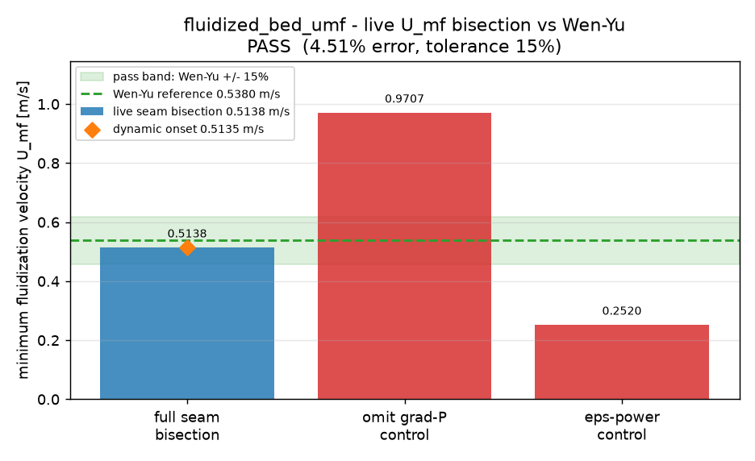

# Minimum fluidization velocity U_mf

This example measures incipient fluidization in the unresolved DEM-CFD seam. A
freely moving DEM bed is driven by upward gas flow, and the gate compares the live
seam bisection for `U_mf` against the Wen & Yu (1966) reference. The same run also
reports the dynamic onset from the integrated bed acceleration and two negative
controls that must fall outside the tolerance.

Regenerate the figure from the example output with:

```sh
$BENCH_PYTHON examples/fluidized_bed_umf/plot.py
```



Live seam bisection passes against the Wen & Yu reference; both negative controls
fall outside the visible tolerance band.
